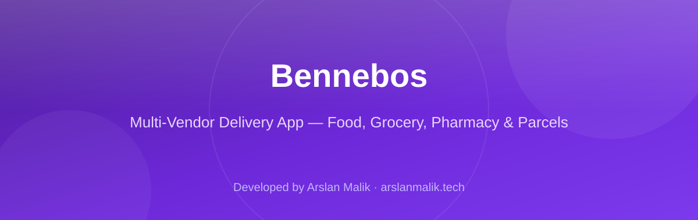
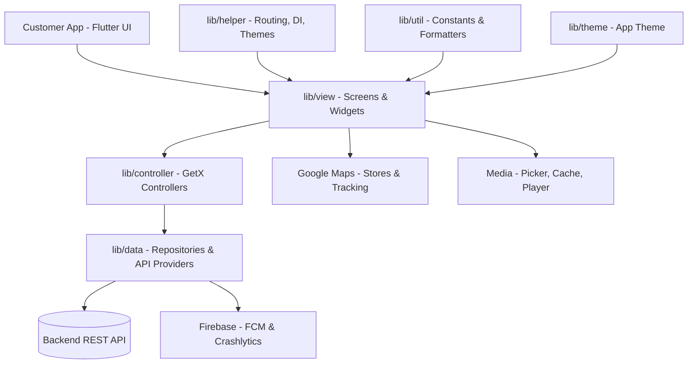

<p align="center">
  
</p>

<p align="center">
  
  
  
  
  
  
</p>

> **Developed by [Arslan Malik](https://github.com/arsalanmaalik461)**
> 📱 WhatsApp: [+92 300 8987448](https://wa.me/923008987448) · 🌐 Website: [arslanmalik.tech](https://arslanmalik.tech)

---

## 🌟 Executive Overview

**Bennebos** is a cross-platform, multi-vendor on-demand delivery application built with Flutter and Dart. It connects customers with nearby stores and vendors through a single app, covering food delivery, grocery, eCommerce shops, pharmacy orders, and parcel services — all backed by map-based store discovery and live delivery tracking.

The codebase follows the proven 6amMart multi-vendor architecture: a layered structure of views, GetX controllers, data providers, helpers and utilities, with Firebase for push notifications and crash reporting, Google Maps for location and animated delivery tracking, and social sign-in (Google, Facebook, Apple) alongside OTP phone verification. It compiles for Android, iOS and Web from one codebase.

---

## 📑 Table of Contents

- [✨ Key Features & Highlights](#-key-features--highlights)
- [🖥️ Feature Showcase](#️-feature-showcase)
- [🏗️ System Architecture](#️-system-architecture)
- [🚀 Quickstart & Installation Guide](#-quickstart--installation-guide)
- [📂 Project Structure](#-project-structure)
- [🛡️ Security & Notes](#️-security--notes)

---

## ✨ Key Features & Highlights

| Feature | Description |
| :--- | :--- |
| 🛒 Multi-vendor marketplace | Food, grocery, eCommerce, pharmacy and parcel modules in one app |
| 🗺️ Maps & live tracking | Google Maps store discovery, geolocation and animated delivery markers (`flutter_animarker`) |
| 🔔 Push notifications | Firebase Cloud Messaging + local notifications for order updates |
| 🔑 Social & OTP login | Google, Facebook and Apple sign-in plus OTP verification (`pin_code_fields`) |
| 🌍 Multi-language | Localisation-ready via the `intl` package |
| 🖼️ Media handling | Image picker, compression, caching (`cached_network_image`) and full-screen photo viewer |
| 💳 In-app webview | `flutter_inappwebview` for payment gateways and embedded web content |
| 🎠 Polished UI | Carousel sliders, shimmer loading states, expandable bottom sheets, slidable list tiles |
| 📊 Crash reporting | Firebase Crashlytics integrated for production stability monitoring |
| 📱 Cross-platform | One codebase targeting Android, iOS and Web |

---

## 🖥️ Feature Showcase

### 1. On-Demand Ordering Across Five Verticals

> One app for food, grocery, eCommerce, pharmacy and parcels — browse nearby stores, place orders and pay in-app.

- Multi-vendor store listings with search and typeahead suggestions
- Product carousels, categories and detail views
- Cart, checkout and order placement flow driven by GetX controllers

### 2. Live Location, Maps & Delivery Tracking

> Map-based store discovery and animated real-time tracking of the delivery rider.

- Google Maps integration on mobile and web
- Geolocator-based current-location detection
- Animated markers for live delivery tracking (`flutter_animarker`)

### 3. Notifications, Auth & Media

> Firebase-powered push notifications, flexible login options and rich media support.

- FCM + `flutter_local_notifications` for order status alerts
- Google, Facebook and Apple sign-in; OTP via pin code fields
- Image pick/compress/cache pipeline and video/YouTube playback support

---

## 🏗️ System Architecture



---

## 🚀 Quickstart & Installation Guide

### Prerequisites

- [Flutter SDK](https://flutter.dev/docs/get-started/install) `>= 3.0.6 < 4.0.0`
- Android Studio or VS Code with the Flutter/Dart extensions
- Your own Firebase project config: `google-services.json` (Android) and `GoogleService-Info.plist` (iOS)
- A Google Maps API key with Maps SDK enabled

### Step-by-Step Installation

```bash
git clone https://github.com/arsalanmaalik461/Bennebos.git
cd Bennebos
flutter pub get
```

### Run the app

```bash
# Android / iOS (emulator or connected device)
flutter run

# Web
flutter run -d chrome

# Release build (Android APK)
flutter build apk --release
```

> **Note:** Add your Firebase configuration files and Google Maps API key before building — the app will not start correctly without them.

---

## 📂 Project Structure

```
Bennebos/
├── lib/
│   ├── main.dart        # App entry point
│   ├── controller/      # GetX controllers (business logic & state)
│   ├── data/            # Models, repositories, API providers
│   ├── helper/          # Routing, dependency injection, helpers
│   ├── theme/           # App theme (colors, text styles)
│   ├── util/            # Constants, formatters, utilities
│   └── view/            # Screens and reusable widgets
├── assets/              # Images, language files, fonts
├── android/             # Android native project
├── ios/                 # iOS native project
├── web/                 # Web build support
├── test/                # Widget tests
├── docs/assets/         # README banner
└── pubspec.yaml         # Dependencies (Flutter SDK >= 3.0.6)
```

---

## 🛡️ Security & Notes

- **API keys & secrets:** never commit `google-services.json`, `GoogleService-Info.plist` or Google Maps API keys to the repo — keep them in local, untracked config.
- **Backend dependency:** the app consumes a REST backend (6amMart-compatible); point the base URL in the data layer to your own server.
- **Payments:** webview-based payment flows should always be served over HTTPS and validated server-side.
- **Permissions:** location, camera and notification permissions are requested at runtime — declare them in the Android manifest and iOS Info.plist.

---

<p align="center">
  <sub>Developed with ❤️ by <a href="https://github.com/arsalanmaalik461">Arslan Malik</a> · 📱 <a href="https://wa.me/923008987448">WhatsApp: +92 300 8987448</a> · 🌐 <a href="https://arslanmalik.tech">arslanmalik.tech</a></sub>
</p>
